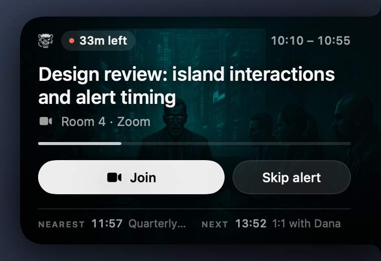
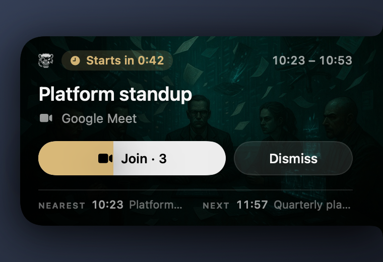
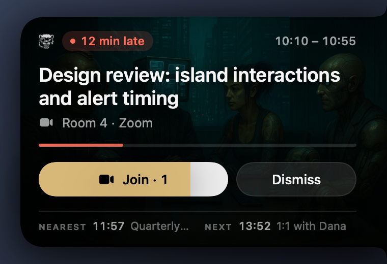
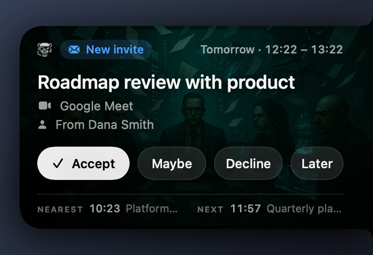
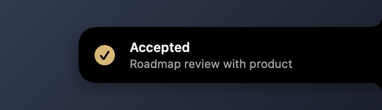
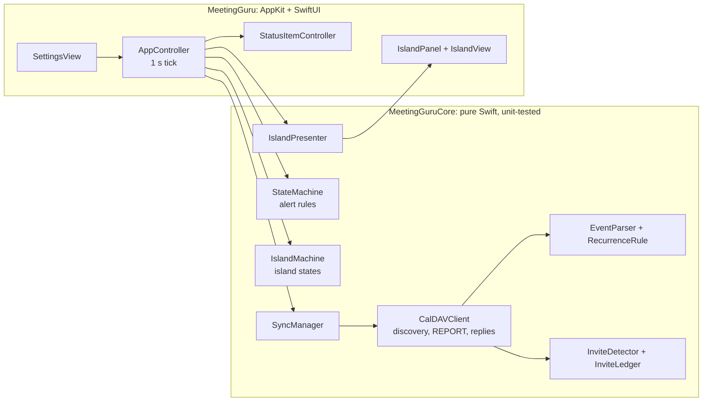

# MeetingGuru

**A small black island on the right edge of your Mac's screen that keeps an eye on your calendar.**

It glows as your next meeting gets closer, opens the call for you when it starts, and lets you accept or decline new invitations without opening a calendar app.

Native Swift and SwiftUI. Works with any CalDAV calendar. No accounts, no cloud service, no tracking.

[](#install)
[](Package.swift)
[](LICENSE)
[](https://github.com/moaddib666/MeetGuru/actions/workflows/ci.yml)

<br clear="right">

```bash
git clone https://github.com/moaddib666/MeetGuru.git && cd MeetGuru && make install
```

## A meeting, start to finish

The island stays out of the way until something needs you. Everything around it stays clickable.

<table>
  <tr>
    <td width="50%" valign="top">
      
      <p><b>15, 5 and 1 minute before.</b> The collapsed island glows blue, then orange, then red, and breathes faster as the meeting gets closer. A blue dot means an invitation is waiting for your answer.</p>
    </td>
    <td width="50%" valign="top">
      
      <p><b>Any time.</b> Hover to peek at the meeting in progress or the next one; click to keep it open. <i>Join</i> opens the call, <i>Skip alert</i> silences its countdown.</p>
    </td>
  </tr>
  <tr>
    <td width="50%" valign="top">
      
      <p><b>1 minute before.</b> The alert opens by itself with a countdown. A brass fuse burns across <i>Join</i>, and the call opens when it runs out (after 5 seconds by default).</p>
    </td>
    <td width="50%" valign="top">
      
      <p><b>Running late.</b> If you haven't joined yet, the alert stays open and shows how late you are in coral.</p>
    </td>
  </tr>
</table>

Zoom, Google Meet, Microsoft Teams, Webex, GoTo, Whereby, Jitsi and other links are found in the event's conference fields, URL, location or description.

## Answer invitations from the island

When someone invites you, the island opens with a soft chime so you can answer on the spot. MeetingGuru saves your answer to the event on your calendar server, and the server sends the reply to the organiser.

<table>
  <tr>
    <td width="50%" valign="top">
      
      <p><b>Accept, Maybe, Decline</b>, or <b>Later</b> to answer it from the menu bar instead. A repeating invite is answered for the whole series.</p>
    </td>
    <td width="50%" valign="top">
      
      <p>A short confirmation, then the island folds away. If the reply can't be sent, it says so and brings the invite back.</p>
    </td>
  </tr>
</table>

Invites for the next 60 days are checked on every sync. They never cover a meeting alert and wait while alerts are paused. If the organiser moves the meeting, it comes back so you can answer again.

## Menu bar


The menu bar icon opens with your next meeting, then up to six upcoming ones (click to join), pending invitations, *Sync Now*, *Do Not Disturb* (pause alerts for 30 minutes, up to 12 hours, or until you resume) and *Settings*.

<br clear="right">

## Install

You need macOS 14 Sonoma or later on Apple silicon, and Xcode 16 or later. The Command Line Tools with Swift 6 (`xcode-select --install`) should also work.

```bash
git clone https://github.com/moaddib666/MeetGuru.git
cd MeetGuru
make install
```

`make install` builds the app, puts it in `/Applications`, moves any previous copy to the Trash and launches it. Use `make install INSTALL_DIR=~/Applications` if you can't write to `/Applications`. The app is built and signed on your own Mac, so Gatekeeper doesn't ask about it.

To remove it: `make uninstall`. Your settings stay in `~/Library/Application Support/MeetingGuru`.

A Homebrew install is planned; see the [roadmap](ROADMAP.md).

## Connect your calendar

Click the menu bar icon, choose **Settings…**, pick your provider and fill in your details. **Test connection** checks them before you **Save**.

| Provider | Server URL | Username and password |
|----------|------------|-----------------------|
| iCloud | `https://caldav.icloud.com/` | Apple ID and an [app-specific password](https://support.apple.com/102654) |
| Google Calendar | `https://apidata.googleusercontent.com/caldav/v2/` | Gmail address and an app password |
| Nextcloud | `https://your-host/remote.php/dav/calendars/you/` | Your Nextcloud login |
| PrivateEmail | `https://dav.privateemail.com/` | Mailbox address and password |
| Anything else | Your server's CalDAV URL | Your login, or a bearer token |

PrivateEmail is used every day; the other presets follow each provider's documented CalDAV setup, and reports on how they behave are welcome.

MeetingGuru looks at the calendar named in Settings (the first one by default), from yesterday to two days ahead, and resyncs every minute and whenever your Mac wakes.

## Privacy

- MeetingGuru talks only to the CalDAV server you configure, and opens meeting links in your browser. There is no analytics or telemetry.
- Settings live in `~/Library/Application Support/MeetingGuru/config.json`, readable only by your user. Your password is stored in that file; moving it to the Keychain is on the [roadmap](ROADMAP.md).
- Logs go to the macOS unified log: `log stream --predicate 'subsystem == "com.meetingguru.app"'`.

## Command line

The app binary takes a few flags, handy for trying things out:

| Flag | What it does |
|------|--------------|
| `--demo-mode` | Sample meetings and an invitation, no calendar needed (`make demo`) |
| `--demo-tour` | Plays the tour at the top of this page, then quits |
| `--sync-once` | Fetches your calendar once, lists meetings and pending invitations, and exits |
| `--show-config` | Prints your settings with secrets hidden |
| `--render-gallery DIR` | Renders every island state to PNG files (`make gallery`) |
| `-c`, `--config PATH` | Uses another settings file |
| `-e`, `--env-config` | Reads `MEETINGGURU_*` environment variables instead of the settings file |
| `-d`, `--debug` | Prints debug logging to the terminal |

```bash
/Applications/MeetingGuru.app/Contents/MacOS/MeetingGuru --sync-once
```

## How it's built



All calendar, recurrence, scheduling and island logic lives in `MeetingGuruCore` with no UI dependencies, so it's covered by fast unit tests (`make test`). The app target only draws and wires things together. There are no third-party dependencies.

## Contributing

Bug reports, fixes and ideas are welcome. [CONTRIBUTING.md](CONTRIBUTING.md) covers the setup, the `make` targets and how to preview UI changes. Planned work is in [ROADMAP.md](ROADMAP.md).

## License

[MIT](LICENSE)
