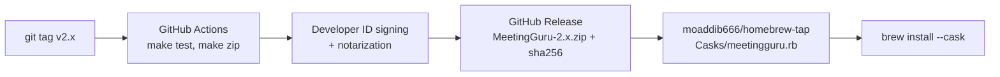

# Roadmap

Planned work, roughly in priority order. Ideas and pull requests for any of these are welcome; open an issue first for the bigger ones.

## Install with Homebrew

Today MeetingGuru is built from source with `make install`. The goal is:

```bash
brew install --cask moaddib666/tap/meetingguru
```

How to get there:



- **Release workflow.** A GitHub Actions job on each `v*` tag runs the tests, then `make zip VERSION=…`, and uploads the zip and its SHA-256 to a GitHub Release.
- **Signing and notarization.** Apps downloaded from the internet are quarantined, and Gatekeeper blocks an ad-hoc-signed app. A smooth `brew install --cask` needs a Developer ID certificate (Apple Developer Program), a hardened-runtime signature and notarization with `xcrun notarytool`, then `xcrun stapler staple`. Until that's in place, the release notes explain how to allow the app in *System Settings → Privacy & Security*.
- **Our own tap.** Create `github.com/moaddib666/homebrew-tap` with `Casks/meetingguru.rb` pointing at the release zip (`version`, `sha256`, `url`, `app "MeetingGuru.app"`, `depends_on macos: ">= :sonoma"`, `depends_on arch: :arm64`, and a `zap` stanza for `~/Library/Application Support/MeetingGuru`). The release workflow bumps the cask automatically, for example with `brew bump-cask-pr` or a small commit to the tap.
- **Build from source through Homebrew (optional stepping stone).** A formula in the same tap can run `swift build -c release` and install the app into the Homebrew prefix. Locally built apps aren't quarantined, so this works without notarization, but it needs Xcode on the user's Mac and doesn't put the app in `/Applications` by itself. The cask stays the main route.
- **homebrew/cask (later).** Once releases are notarized and the project meets Homebrew's notability rules, submit the cask to the main `homebrew/cask` repository so `brew install --cask meetingguru` works without the tap.

## App

- **Password in the Keychain** instead of `config.json`, migrating existing settings on first launch.
- **Open at login** with `SMAppService`, as a switch in Settings.
- **Several calendars** at once, instead of the single calendar picked in Settings.
- **Automatic updates**, for example with Sparkle, once releases are signed.
- **Universal build** (Apple silicon and Intel).
- **Answer a single occurrence** of a repeating invite, not only the whole series.
- **Choose the island's edge and screen** on multi-display setups.
